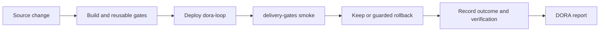

# delivery-gates

CI/CD gates as portable scripts, wrapped for GitHub Actions — and a harness
that proves each one fires.

## How this was built

This repository and [dora-loop](https://github.com/jjackson0118/dora-loop) were
built in two days by one person directing AI coding agents — Claude Opus 5 for
roughly 80% of the work, Codex (GPT-6 Astra) for the remainder — and that is
half of what they are meant to show. The maintainer set the objective, scope,
references, and acceptance criteria, and decided what counted as done; the
agents implemented, and reviewed each other's work adversarially. Every change
went through a branch, a pull request, the gates, and a squash merge.

**The comments are the history.** The source comments are long and narrate
specific failures. They were written by the agents as each defect was found and
every one was left in on purpose: they are the record of the AI build as it
happened, in the place a reader will meet the code they describe. Read them as
history, not as style.

The full account — who did what, why the handoff happened mid-build, the eight
defects the review loop caught that the gates did not, and what was never
delegated — is [How it was built](https://github.com/jjackson0118/delivery-gates/wiki/How-It-Was-Built).

## The idea

A platform team's product is not a pipeline. It is the paved road other teams
drive on. So the gates here are plain scripts with a defined contract, and the
CI platform is a thin wrapper over them:

```
gates/secrets.sh  <-- the gate
      ^      ^
      |      +---- .github/workflows/  (GitHub Actions calls it)
      +----------- prove-gates-fail.sh (the harness calls the same script)
```

If a gate is only expressible in workflow YAML, it isn't a gate — it's a
feature of one CI vendor. Scripts port; YAML doesn't. It also means the proof
exercises the real gate rather than a copy of it, which is the difference
between evidence and theatre.

A second orchestrator (Jenkins) was scoped and cut. Portability is a property
of the design; a second orchestrator is not something this repository can
demonstrate today. See the [scope decisions](docs/wiki/Roadmap.md).

## Review the two repositories

Start with [the gate contract](docs/wiki/The-Gate-Contract.md), then
[the fault harness and its limits](docs/wiki/Proving-Gates-Fail.md). For the
consumer side, follow [dora-loop's deployment record](https://github.com/jjackson0118/dora-loop/wiki/Deployment):
CI builds and gates the service, deploys it to a private VM, runs this repository's
smoke gate, and posts the observed deployment result back to the service.
[The first completed loop](https://github.com/jjackson0118/dora-loop/actions/runs/34051994184)
is linked from that record with the independent read-back and replay evidence.



The code and documentation are public; the demonstration service is private.
Reviewing the evidence requires no access to the author's infrastructure.
To use the gates in your own repository, see [Using it](docs/wiki/Using-It.md).

## The contract

| exit | meaning |
|---|---|
| `0` | the gate ran, examined something, and found nothing |
| `1` | the gate ran and found the thing it looks for |
| `2` | the gate could not run, or ran and examined nothing |
| `3` | the gate does not apply to this repository |

The `1`/`2` split carries most of the weight. A caller that treats "non-zero"
as proof a gate fired will accept a scanner that crashed on startup — which
proves nothing and is indistinguishable from coverage.

**Every gate must declare what it examined.** A gate that examined nothing
exits `2`, never `0`. Most tools produce identical output for an empty scan and
a clean scan; treating those the same is how a check reports PASS for weeks
after its input quietly disappeared.

Why `3` exists, what it cost to learn, and how each rule is enforced:
[the gate contract](https://github.com/jjackson0118/delivery-gates/wiki/The-Gate-Contract).

## A gate nobody has seen fail is not known to work

`prove-gates-fail.sh` injects a real defect into a real repository and asserts
the **exact** exit code and the **exact** rule id each gate must return. It runs
both directions — every gate quiet on a clean tree, every declared fault caught
— because a gate never observed refusing anything is not known to work, and one
never observed accepting anything is not known to discriminate.

Two entries in the corpus test the harness rather than the gates.
`faults/_control-noop` injects nothing and must come back clean.
`faults/_selftest-phantom` declares a fault it never injects, and the harness is
*required* to report it as not caught — because if this harness ever reports
"caught" for something never applied, every other row is worthless.

A full run, the declared denominators, and an honest account of what the floors
do **not** catch: [proving the gates fail](https://github.com/jjackson0118/delivery-gates/wiki/Proving-Gates-Fail).

## Documentation

The [wiki](https://github.com/jjackson0118/delivery-gates/wiki) is the long
form. Its pages are authored in [`docs/wiki/`](docs/wiki/) in this repository
and published by CI, so they are reviewed, versioned with the code, and checked
by the `docs` gate — rather than living in the one place no gate can reach.

| | |
|---|---|
| [The gate contract](https://github.com/jjackson0118/delivery-gates/wiki/The-Gate-Contract) | The four exit codes and why they are four. |
| [Proving the gates fail](https://github.com/jjackson0118/delivery-gates/wiki/Proving-Gates-Fail) | The harness, the fault corpus, declared denominators. |
| [Using it](https://github.com/jjackson0118/delivery-gates/wiki/Using-It) | Calling the reusable workflow, and declaring your floors. |
| [The gates](https://github.com/jjackson0118/delivery-gates/wiki/The-Gates) | What each gate checks, and the failure that motivated it. |
| [Review process](https://github.com/jjackson0118/delivery-gates/wiki/Review-Process) | One maintainer, no second human, and what replaces one. |
| [How it was built](https://github.com/jjackson0118/delivery-gates/wiki/How-It-Was-Built) | Two days, one person, two AI agents — and why every comment stayed. |
| [Roadmap](https://github.com/jjackson0118/delivery-gates/wiki/Roadmap) | What is left, in order — and what was cut, and why. |

[`dora-loop`](https://github.com/jjackson0118/dora-loop) is the service these
gates run against: it computes the four DORA metrics and refuses to report a
number it did not observe.

## License

Apache-2.0.
